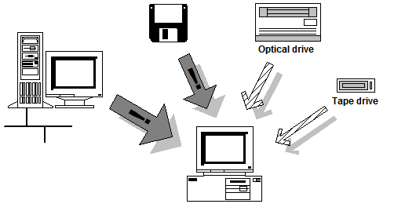
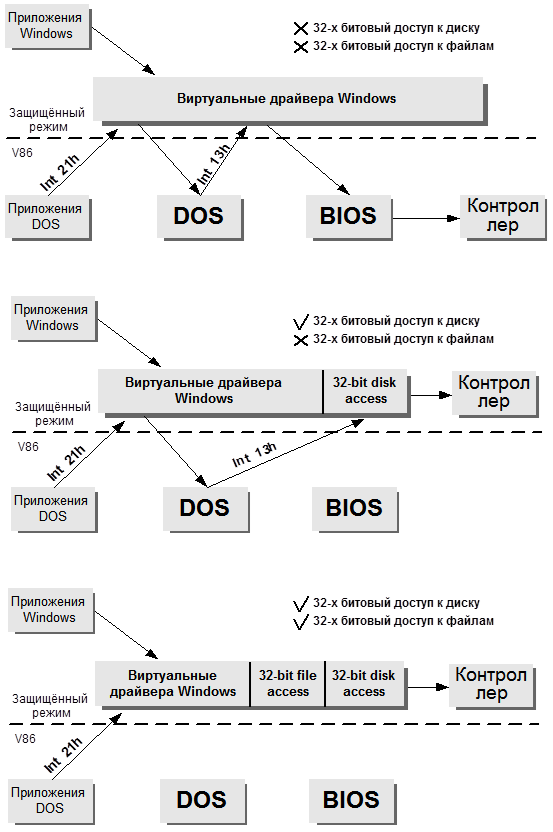

## ChkFlop V2

>[Полная документация](./Doc/SYS2.DOC)

В этой работе решается задача создания пакета программ, обеспечивающих автоматическое тестирование гибкого диска при его замене с целью предотвращения проникновения в персональную вычислительную систему вирусов. Главная идея разработки - автоматизация контроля информации, поступающей через один из наиболее вероятных каналов “заражения” - накопители на гибких дисках.

## Разбиение функциональности по компонентам

1. Обработчики реального режима помещены в TSR chkflop.com. При запуске она выполняет все необходимые начальные тесты и инициализацию: проверку типа процессора, контроль на целостность, проверку своей инсталляции, загрузку параметров конфигурации. Если пакет был уже запущен или не прошёл какой-либо из тестов, то загрузка будет отменена. При отсутствии этой программы в памяти во время старта Windows не будут запущены компоненты защищённого режима. В сеансе DOS реального режима эта TSR выполняет отслеживание смены гибких дисков и в соответствии с текущей конфигурацией реагирует на это. Здесь реализован контроль серийных номеров гибких дисков. Если номер диска найден в кольцевой очереди, то обработчик 13h не будет выставлять запрос на тестирование. Это работает и в сеансе Windows, так как там используется генерация запроса из обработчика13h. TSR отслеживает запуск Windows, регистрируется в службе поддержки TSR Windows, изменяет логику своей работы и инициирует запуск менеджера тестирования защищённого режима chk_f.exe.
1. TSR при старте выполняет загрузку параметров текущей конфигурации через запуск компилятора файла chkflop.ini iniload.exe. Эта программа  реального режима считав и интерпретировав chkflop.ini передаёт блок памяти с внутренним представлением конфигурации в TSR и завершается. В дальнейшем она больше не используется. Редактор конфигурации защищённого режима самостоятельно читает этот файл. 
1. chk_drv.dll - загружаемый драйвер, отвечающий за конфигурирование пакета и содержащий перехватчик запросов на тестирование из обработчика 13h TSR, выполняющейся в V86 режиме на системной виртуальной машине. При загрузке он производит перехват вызова функции реального режима через DPMI Int 31h и регистрируется в TSR, передавая туда эмуляцией Int 2Fh реального режима(на системную V86 VM) перехваченный адрес. В своём обработчике перехвата(CALLBACK) он посылает сообщение главному окну приложения chk_f.exe, которое на основании текущей конфигурации может генерировать последовательность запусков AV-утилит. Этот драйвер выполнен с загрузкой в фиксированный сегмент, что является необходимым требованием для обработчика перехвата функций реального режима и минимизирован по объёму, так как в Windows 3.1 загрузка фиксированных сегментов выполняется в сильно лимитированное пространство 1-го мегабайта. Разнесение функций перехвата и запуска вызвано ещё и тем, что функция перехвата выполняется в контексте прерывания, что не позволяет пользоваться асинхронными вызовами Windows.
1. chk_f.exe - при своей загрузке(инициированной chkflop.com TSR) открывает драйвер chk_drv.dll и регистрируется в нём(передаёт туда HWND своего окна). Если запуск chk_f.exe не был инициирован TSR, а другим способом, то она выдаёт сообщение об ошибке и завершается. Загруженный драйвер выполнив перехват и зарегистрировавшись в TSR ждёт. chk_f.exe, в свою очередь, ждёт сообщений от драйвера. При поступлении такового выполняет запуск антивирусных утилит прочитав конфигураци из блока скомпилированных параметров, который находится в TSR(путём эмуляции прерывания реального режима на системной V86 машине и создания синхронизированного селектора для физического адреса реального режима с целью доступа к блоку конфигурации).
1. chk_cfg.dll - вызывается chk_f.exe и реализует удобный графический интерфейс представляющий конфигурационные параметры пакета с целью их редактирования пользователем в наиболее наглядной и удобной форме. Выделение функций конфигурирования в отдельную библиотеку обосновывается соображениями экономии ресурсов - она даже не подлинкована к chk_f.exe через библиотеку импорта. Изменение конфигурации - редкое действие и поэтому chk_f.exe выполняет её загрузку по запросу.
